# 👋 Andrew San Antonio

<p align="center">
  
</p>

<h1 align="center">
  
</h1>

<!-- Three.js Style Loading Animation -->
<p align="center">
  
</p>

<p align="center">
  <a href="https://github.com/AndrewSanAntonio1">
    
  </a>
  <a href="https://www.linkedin.com/in/andrew-jr-f-san-antonio-1329b7379/">
    
  </a>
  <a href="mailto:sgandrew290@gmail.com">
    
  </a>
  <a href="https://andrewsanantonio1.github.io/My-Personal-Portfolio/">
    
  </a>
</p>

---

<div align="center">

## 🚀 `const aboutMe = {`

</div>

```javascript
{
  location: "🇵🇭 Philippines",
  role: "Full Stack Java Developer",
  focus: ["Spring Boot", "React", "Three.js"],
  passion: "Building immersive web experiences",
  approach: "AI-assisted development",
  mindset: "Always learning, always building",
  currently: "Exploring 3D web graphics with Three.js"
}
```

<div align="center">

## `}`

</div>

---

## 💻 `<TechStack />`

<div align="center">

### ⚡ Core Technologies

<table>
<tr>
<td align="center" width="25%">
<br>
<sub><b>Java</b></sub><br>
<sub>⬢⬢⬢⬢⬢⬢⬢⬢⬡⬡</sub><br>
<sub>80%</sub>
</td>
<td align="center" width="25%">
<br>
<sub><b>Spring Boot</b></sub><br>
<sub>⬢⬢⬢⬢⬢⬢⬢⬢⬡⬡</sub><br>
<sub>80%</sub>
</td>
<td align="center" width="25%">
<br>
<sub><b>React</b></sub><br>
<sub>⬢⬢⬢⬢⬢⬢⬢⬡⬡⬡</sub><br>
<sub>75%</sub>
</td>
<td align="center" width="25%">
<br>
<sub><b>Three.js</b></sub><br>
<sub>⬢⬢⬢⬢⬡⬡⬡⬡⬡⬡</sub><br>
<sub>40%</sub>
</td>
</tr>
<tr>
<td align="center" width="25%">
<br>
<sub><b>JavaScript</b></sub><br>
<sub>⬢⬢⬢⬢⬢⬢⬢⬡⬡⬡</sub><br>
<sub>75%</sub>
</td>
<td align="center" width="25%">
<br>
<sub><b>MySQL</b></sub><br>
<sub>⬢⬢⬢⬢⬢⬢⬢⬡⬡⬡</sub><br>
<sub>70%</sub>
</td>
<td align="center" width="25%">
<br>
<sub><b>Docker</b></sub><br>
<sub>⬢⬢⬢⬢⬢⬢⬡⬡⬡⬡</sub><br>
<sub>60%</sub>
</td>
<td align="center" width="25%">
<br>
<sub><b>Git</b></sub><br>
<sub>⬢⬢⬢⬢⬢⬢⬢⬢⬡⬡</sub><br>
<sub>80%</sub>
</td>
</tr>
</table>

### 🛠️ Full Tech Arsenal


</div>

---

## 🤖 `AI.assistedDevelopment()`

<div align="center">

```typescript
interface AIWorkflow {
  tools: ["ChatGPT", "Claude", "Codex", "Kiro"];
  purpose: {
    architecture: "ChatGPT",
    codeReview: "Claude", 
    generation: "Codex",
    debugging: "Kiro"
  };
  result: "10x productivity boost";
}
```

| 🤖 AI Tool | 🎯 Primary Use | ⚡ Impact |
|-----------|---------------|----------|
| **ChatGPT** | Architecture & Design | Problem solving at scale |
| **Claude** | Code Review & Docs | Quality assurance |
| **Codex** | Code Generation | Rapid prototyping |
| **Kiro** | Debug & Refactor | Efficiency boost |

</div>

---

## 🎯 `render() { currentFocus }`

<div align="center">

```javascript
const currentGoals = {
  backend: {
    mastering: ["Spring Boot Architecture", "Clean Code Principles"],
    exploring: ["Microservices", "Cloud Deployment"],
    progress: "⬢⬢⬢⬢⬢⬢⬢⬢⬡⬡ 80%"
  },
  frontend: {
    learning: ["Three.js 3D Graphics", "Advanced React Patterns"],
    building: ["Interactive 3D Experiences", "WebGL Shaders"],
    progress: "⬢⬢⬢⬢⬡⬡⬡⬡⬡⬡ 40%"
  },
  devops: {
    current: ["Docker Containers", "CI/CD Pipelines"],
    next: ["Kubernetes", "AWS Services"],
    progress: "⬢⬢⬢⬢⬢⬢⬡⬡⬡⬡ 60%"
  }
};
```

</div>

---

## 🌟 `<FeaturedProject>`

<div align="center">

### 🏦 Enterprise Banking System

*Full-stack application with modern architecture*

</div>

```javascript
const project = {
  name: "Banking System",
  type: "Full Stack Application",
  stack: {
    backend: "Spring Boot + Spring Security + JWT",
    frontend: "React + Vite",
    database: "MySQL",
    api: "RESTful"
  },
  features: [
    "🔐 Secure Authentication & Authorization",
    "👥 Role-based Access Control",
    "💰 Account Management (Deposit/Withdraw)",
    "🔄 Inter-account Transfers",
    "📊 Transaction History & Audit Trail",
    "✅ Input Validation & Error Handling"
  ],
  highlights: "Enterprise-grade security & Clean architecture"
};
```

---

## � `git --stats`

<p align="center">
  
  
</p>

<p align="center">
  
</p>

---

## 🧠 `class EngineeringPrinciples {`

<div align="center">

```java
public class DeveloperMindset {
    // Core Principles
    private final String[] principles = {
        "SOLID", "DRY", "KISS", "YAGNI"
    };
    
    // Design Patterns
    private final Pattern[] patterns = {
        MVC, Repository, DTO, Factory, Singleton
    };
    
    // Architecture
    private final Architecture stack = new Architecture()
        .withRESTfulAPI()
        .withServiceLayer()
        .withSecurityFirst()
        .withCleanCode();
}
```

</div>

<div align="center">

| 🏗️ Architecture | 🎨 Design Patterns | 🔐 Security |
|---------------|-------------------|------------|
| MVC Pattern | Repository Pattern | Spring Security |
| REST API Design | DTO Pattern | JWT Authentication |
| Service Layer | Factory Pattern | Role-based Auth |
| Clean Architecture | Singleton Pattern | Input Validation |

</div>

## `}`

---

## � `connect()`

<div align="center">

### Let's Build Something Amazing Together

```javascript
const contact = {
  portfolio: "https://andrewsanantonio1.github.io/My-Personal-Portfolio/",
  linkedin: "https://linkedin.com/in/andrew-jr-f-san-antonio-1329b7379/",
  github: "https://github.com/AndrewSanAntonio1",
  email: "sgandrew290@gmail.com",
  status: "Open to opportunities 🚀"
};
```

[](https://[andrewsanantonio1.github.io/My-Personal-Portfolio/](https://my-portfolio-gamma-ruddy-34.vercel.app/))
[](https://www.linkedin.com/in/andrew-jr-f-san-antonio-1329b7379/)
[](mailto:sgandrew290@gmail.com)

</div>

---

<div align="center">

### 💭 `// Philosophy`

```javascript
while (alive) {
  eat();
  code();
  sleep();
  repeat();
}
```

*"Clean code, reliable systems, endless learning."*

---


[](https://github.com/AndrewSanAntonio1)

**⚡ Powered by Three.js aesthetics • Built with ❤️ and ☕ in the Philippines**

</div>

<p align="center">
  
</p>
